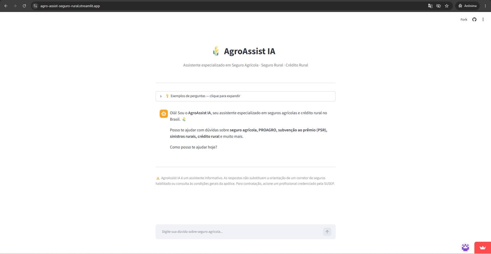
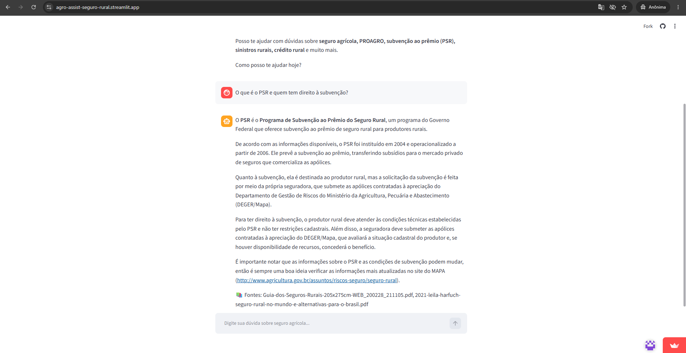
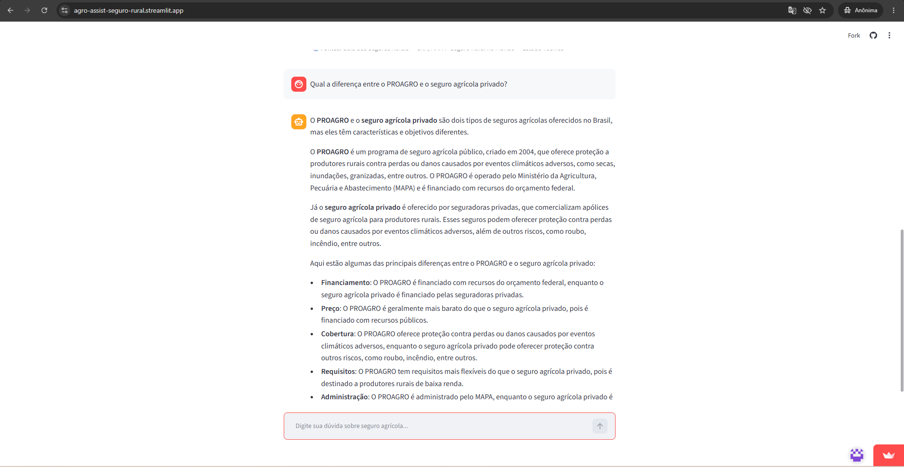
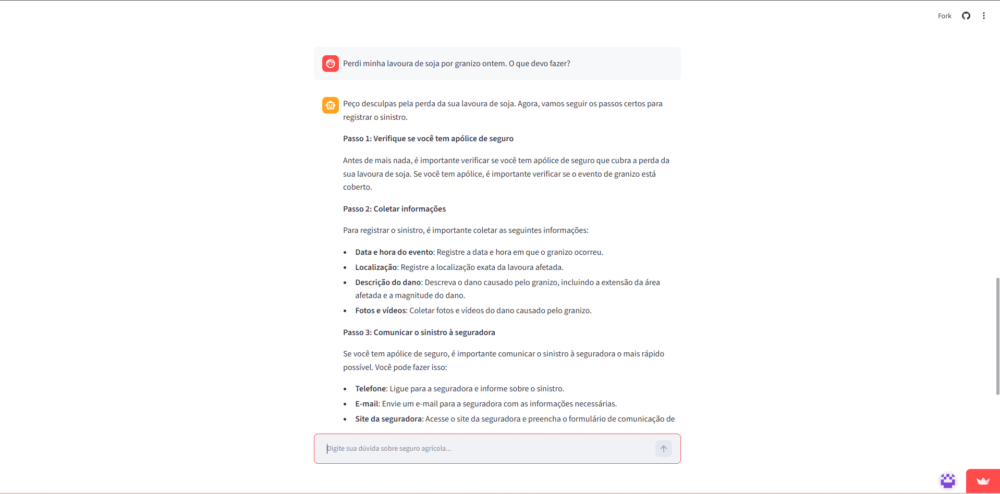
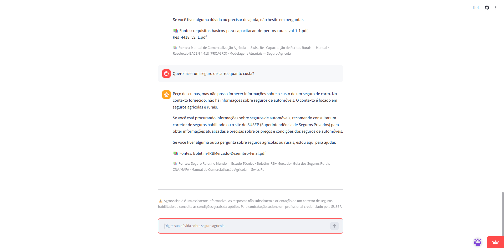
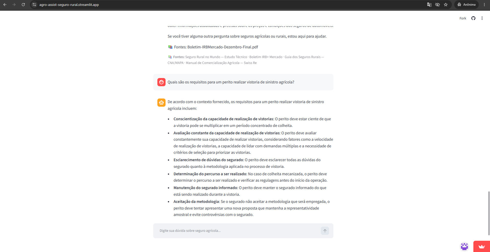
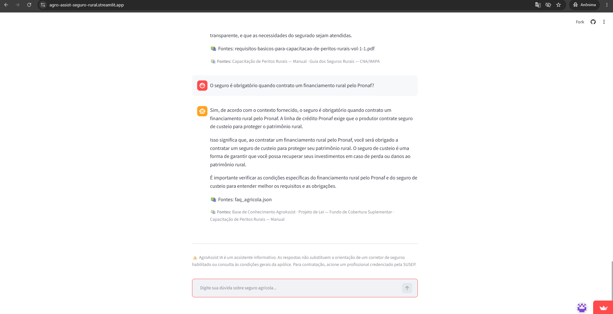
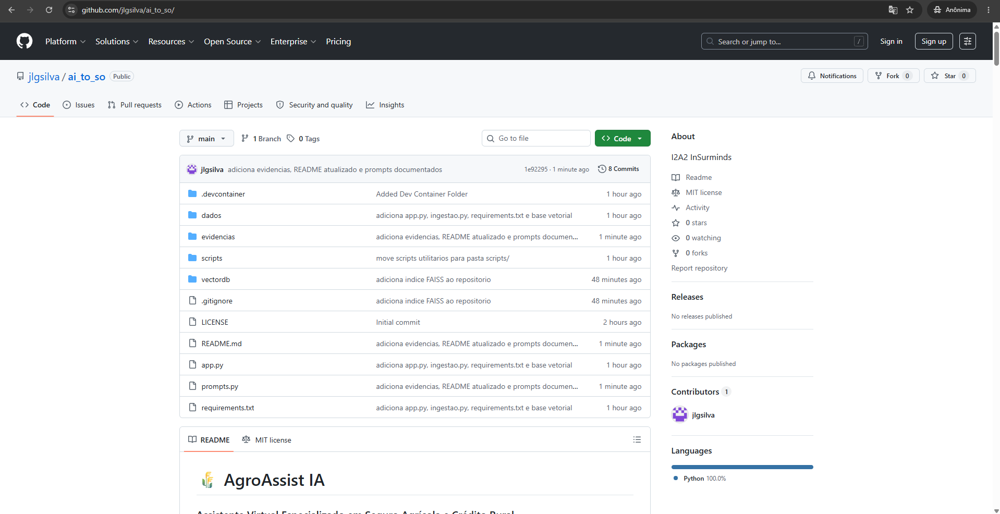

# 📸 Evidências de Execução — AgroAssist IA

Registro das capturas de tela realizadas durante os testes do chatbot online.
Todas as evidências foram coletadas a partir da URL pública:
**https://agro-assist-seguro-rural.streamlit.app/**

---

## 01 — Interface Inicial

Exibe a interface do AgroAssist IA carregada com sucesso no Streamlit Cloud,
com mensagem de boas-vindas personalizada, painel de exemplos de perguntas
expandido e aviso legal no rodapé.

---

## 02 — Dúvida Geral: PSR

**Pergunta:** *"O que é o PSR e quem tem direito à subvenção?"*

O assistente recuperou contexto do **Guia dos Seguros Rurais (CNA/MAPA)** e do
**Estudo Técnico sobre Seguro Rural no Mundo**, explicando que o PSR foi
operacionalizado a partir de 2006, que a subvenção é solicitada pela própria
seguradora junto ao DEGER/MAPA e que a concessão é condicionada à situação
cadastral do produtor e à disponibilidade de recursos orçamentários.

📚 Fontes citadas: Guia dos Seguros Rurais — CNA/MAPA · Seguro Rural no Mundo — Estudo Técnico

---

## 03 — PROAGRO vs Seguro Agrícola Privado

**Pergunta:** *"Qual a diferença entre o PROAGRO e o seguro agrícola privado?"*

Resposta baseada em fontes regulatórias e técnicas, diferenciando os dois
instrumentos em 5 dimensões: financiamento (público vs. privado), custo,
amplitude de cobertura, requisitos de adesão e estrutura de administração.
O assistente recuperou contexto de 5 fontes distintas simultaneamente.

📚 Fontes citadas: Modelagens Atuariais — Seguro Agrícola · Seguro Rural no Mundo — Estudo Técnico · Base de Conhecimento AgroAssist · Capacitação de Peritos Rurais — Manual · Guia dos Seguros Rurais — CNA/MAPA

---

## 04 — Fluxo Guiado de Sinistro

**Pergunta:** *"Perdi minha lavoura de soja por granizo ontem. O que devo fazer?"*

O classificador de intenção identificou o evento como sinistro e ativou o fluxo
guiado. O assistente orientou o produtor em 5 passos estruturados: verificação
da apólice, coleta de evidências (fotos, data, localização), comunicação à
seguradora, envio de documentos e acompanhamento da análise. Reforçou a
criticidade do prazo de comunicação.

📚 Fontes citadas: Manual de Comercialização Agrícola — Swiss Re · Capacitação de Peritos Rurais — Manual · Resolução BACEN 4.418 — PROAGRO · Modelagens Atuariais — Seguro Agrícola

---

## 05 — Guardrail: Pergunta Fora do Escopo

**Pergunta:** *"Quero fazer um seguro de carro, quanto custa?"*

O guardrail funcionou corretamente: o assistente recusou responder sobre seguro
de automóvel, explicou seu escopo especializado em seguros agrícolas e rurais,
e redirecionou o usuário para a SUSEP. A citação de fonte apontou para
documentos de seguro rural — confirmando que o RAG não contém informações sobre
seguros de automóvel e que nenhuma resposta foi inventada.

📚 Fontes citadas: Seguro Rural no Mundo — Estudo Técnico · Boletim IRB+ Mercado · Guia dos Seguros Rurais — CNA/MAPA · Manual de Comercialização Agrícola — Swiss Re

---

## 06 — Resposta com Múltiplas Fontes

**Pergunta:** *"Quais são os requisitos para um perito realizar vistoria de sinistro agrícola?"*

Resposta baseada no **Manual de Capacitação de Peritos Rurais**, detalhando:
gestão de capacidade em períodos concentrados de colheita, esclarecimento de
dúvidas metodológicas ao segurado, determinação de percurso em colheita
mecanizada e procedimentos em caso de discordância sobre a metodologia.

📚 Fontes citadas: Capacitação de Peritos Rurais — Manual · Guia dos Seguros Rurais — CNA/MAPA

---

## 07 — Crédito Rural e Obrigatoriedade do Seguro

**Pergunta:** *"O seguro é obrigatório quando contrato um financiamento rural pelo Pronaf?"*

O assistente confirmou a obrigatoriedade do seguro de custeio no Pronaf,
orientando o produtor a verificar as condições específicas do financiamento
e as exigências da linha de crédito contratada.

📚 Fontes citadas: Base de Conhecimento AgroAssist · Projeto de Lei — Fundo de Cobertura Suplementar · Capacitação de Peritos Rurais — Manual

---

## 08 — Repositório GitHub

Estrutura completa do projeto versionada no GitHub (`jlgsilva/ai_to_so`),
com organização profissional das pastas (`dados/`, `scripts/`, `vectordb/`,
`evidencias/`) e histórico de commits documentando a evolução do desenvolvimento.

**URL:** https://github.com/jlgsilva/ai_to_so
